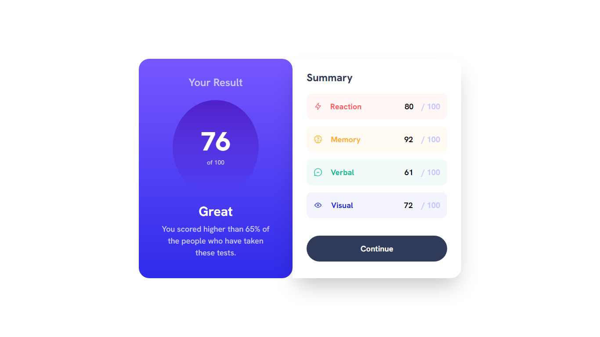

<h1>Results summary component solution</h1>

This is a solution to the [Results summary component challenge on Frontend Mentor](https://www.frontendmentor.io/challenges/results-summary-component-CE_K6s0maV). 

</img>

- Solution URL: [Frontend Mentor](https://www.frontendmentor.io/solutions/results-summary-component-solution-NvaLDVs0Z9)
- Live Site URL: [Deploy](https://kalebemax.github.io/results-summary-component-main/)

<h2>Built with</h2>

- Semantic HTML5 markup
- CSS custom properties
- Tailwind CSS
- Flexbox
- VS Code
- Google Fonts
- Git
- Mobile-first workflow
